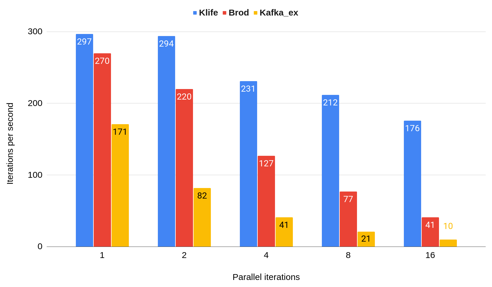
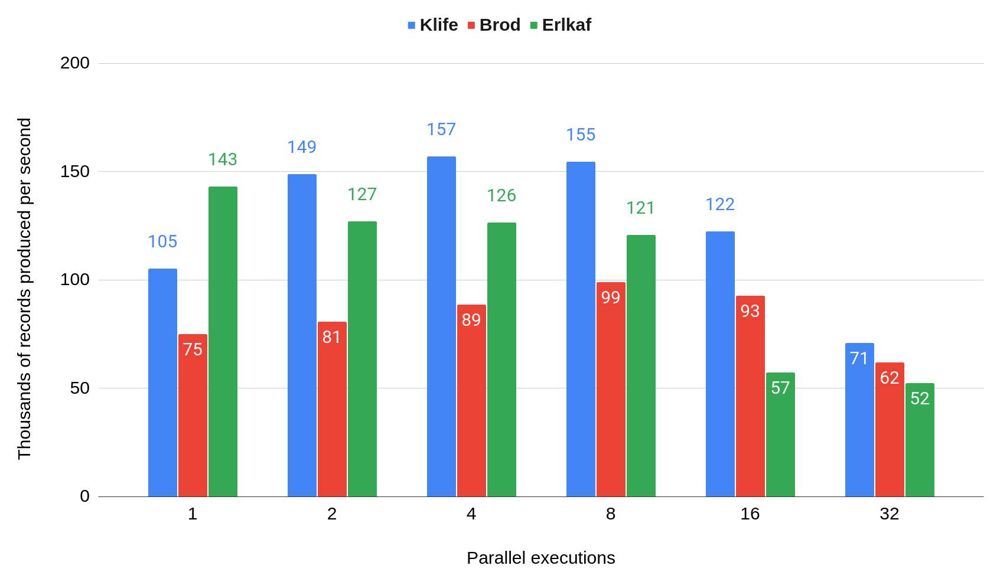

# Benchmarks

## Producer

(TODO: Update benchmarks with newer versions)

I've test it against the 3 awesome community kafka libraries [brod](https://github.com/kafka4beam/brod)
and [kafka_ex](https://github.com/kafkaex/kafka_ex) and [erlkaf](https://github.com/silviucpp/erlkaf)
which are the most popular ones.

The relevant client configuration should be equal on all clients and they are:

- required_acks: all
- max_inflight_request: 1
- linger_ms: 0
- max_batch_size: 512kb

### Produce sync

In order to test sync produce performance we prepared a benchmark that uses [benchee](https://github.com/bencheeorg/benchee) to produce
kafka records on kafka cluster running locally.

The details can be checked out on `benchmark.ex` mix task and the results on `bechmark_results`.

To reproduce it on your setup you can run (16 is the benchee parallel value):

```
bash start-kafka.sh
mix benchmark producer_sync 16
```

Each iteration of the benchmark produces 3 records for 3 different topics in paralel and wait for the completion
in order to move to the next iteration.

The main point driving the Klife's performance is the batching efficiency. As far as I can tell:

- Klife: Batches everything that can be batched together in a single TCP request
- Brod: Batches records only for the same topic/partition in a single TCP request
- Kafka_ex: Does not batch records (I'm not sure if there is a way to change this behaviour)

With this scenario I've executed the benchmark increasing the `parallel` attribute from
benchee from 1 to 16, doubling it each round. The results are the following:



### Produce async

In order to test async produce performance we prepared a test script that produces records asynchronously on
a kafka cluster running locally.

The asynchronous benchmark spawns N parallel processes producing to one of 3 topics in a loop. After 10 seconds,
it calculates the difference between the initial and current offsets for each topic partition to determine
the total records produced and the throughput (records per second).

The details can be checked out on `async_producer_benchmark.ex`.

To reproduce it on your setup you can run (16 is the N value):

```
bash start-kafka.sh
mix benchmark producer_async 16
```



## Consumer

TODO: Do this benchmark! (It is harder to compare due to different rebalance protocols)
